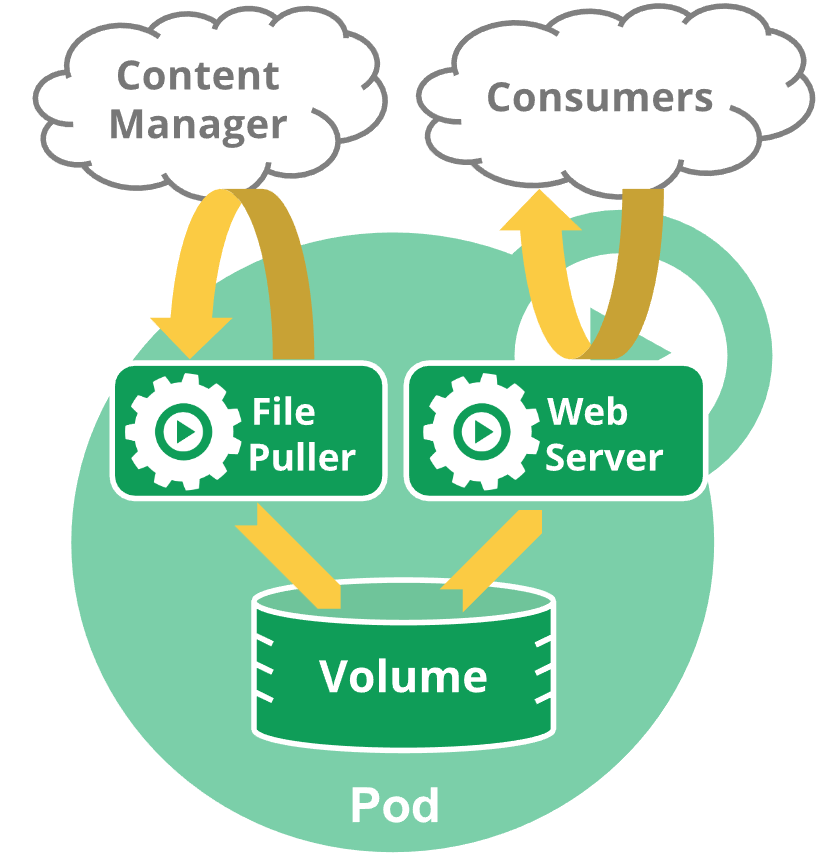

# Workload

워크로드란 Kubernetes에서 구동되는 애플리케이션이다.

Pod가 실행중인 노드에 심각한 장애가 발생하면 해당 노드의 모든 Pod에 장애가 발생한다. 그러나 Pod의 LifeCycle을 관리하기 위해 각 Pod를 직접 관리할 필요가 없으며, 엔지니어 대신 Pod set을 관리하는 Workload Resources를 사용할 수 있다.

## Workload Resources

Pod의 LifeCycle을 관리하기 위해 사용한다.

Pod의 상태가 올바른 수의 올바른 파드의 유형이 실행되고 있는지 확인하는 컨트롤러를 구성한다.

Built-in Workload Resources

- Deployment
- ReplicaSet
- StatefuleSet
- DaemonSet
- Job/CronJob
- Automatic Clean-up for Finished Job
- Replication Controller


## Workload - Pod

> https://kubernetes.io/ko/docs/concepts/workloads/pods/

파드 : 컨테이너의 모음
> 쿠버네티스가 관리할 수 있는 가장 작은 워크로드는 파드

### 파드 생성 및 관리

명령형 커맨드로 파드 생성

``` bash
kubectl run myweb --image httpd
```

파드 목록 확인

``` bash
kubectl get pods
```

특정 파드 확인

``` bash
kubectl get pods myweb
```

파드 상세 정보
``` bash
kubectl get pods -o wide
```

``` bash
kubectl get pods -o yaml
```

``` bash
kubectl get pods -o json
```

``` bash
kubectl describe pods myweb
```

### YAML 파일로 파드 정의

`myweb.yaml`

``` yaml
apiVersion: v1
kind: Pod
metadata:
	name: myweb
spec:
	containers:
		- name: myweb
			image: httpd
			ports:
				- containerPort: 80
					protocol: TCP
```

``` bash
kubectl create -f myweb.yaml
```

``` bash
kubectl get -f myweb.yaml
```

``` bash
kubectl describe -f myweb.yaml
```

``` bash
kubectl delete -f myweb.yaml
```

### kubectl 명령의 서브 명령

- create
- get
- describe
- logs
- delete
- replace
- patch
- apply
- diff

### 파드 디자인



여러 개의 컨테이너를 Pod 단위로 묶어 배포하는 이유

1. Pod 내부 컨테이너 간의 IP 및 Port 공유를 통한 통신 용이성 향상

N개의 컨테이너가 한 개의 Pod에 탑재되어 배포된 애플리케이션의 경우, 컨테이너끼리는 실시간으로 데이터를 교환하며 그에 따라 상태를 업데이트해야 한다.

이때 컨테이너는 별도의 IP 호출 없이 localhost를 통해 통신이 가능하다.

Pod 내부 컨테이너 간의 IP 및 Port를 공유함으로써 상호 동작해야 하는 컨테이너끼리 통신 용이성을 향상시킨다.

2. Pod 내부 컨테이너 간의 디스크 볼륨 공유

컨테이너끼리 디스크 볼륨을 공유할 수 있으며, 로그 수집기를 사이드카 패턴을 통해 Pod에 탑재해 배포할 경우, Pod 내부 컨테이너들의 로그를 모두 수집할 수 있다.

상기의 이유들로 인해 여러 개의 컨테이너를 탑재해 배포하는 것은 장점을 가진다. 이를 통해 만들어진 Pod를 배포하면 단일 인스턴스가 만들어진다. 유저 유입의 증가, 트래픽 증가로 인해 더 많은 리소스를 제공하기 위해 수평적으로 애플리케이션을 확장하려면 단일 인스턴스를 만드는 Pod를 복제하는 HPA를 수행해야 한다.


- 단일 컨테이너 : 일반적인 형태
- 멀티 컨테이너 : 메인 애플리케이션이 존재
	메인 애플리케이션 기능을 확장하기 위한 컨테이너를 배치

> 사이드카 패턴 : https://kubernetes.io/blog/2015/06/the-distributed-system-toolkit-patterns/

- sidecar : 기능의 확장
- ambassador : 프록시 / LB
- adaptor : 출력의 표준

### 포트 및 포트포워딩

테스트 & 디버깅 목적

``` bash
kubectl port-forward pods/myweb 8080:80
```

### 이름 & UID
이름 : 네임스페이스 유일
UID : 클러스터에서 유일