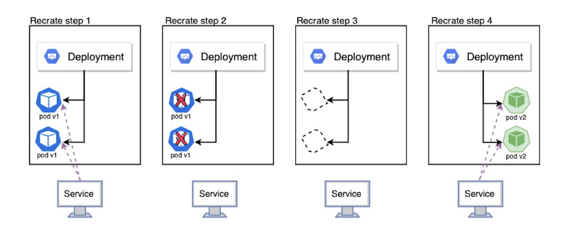
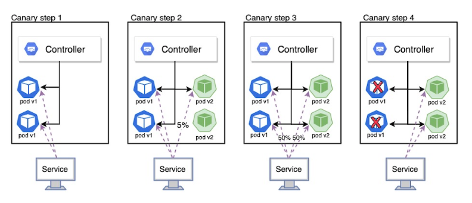

# Deployments

Deployment는 Pod 업데이트를 위해 사용되는 기본 컨트롤러이다.

## Deployment reason for use

> Replica Set을 그대로 사용하지 않고 상위 개념인 Deployment를 사용하는 이유

Deployment는 컨테이너 애플리케이션을 배포하고 관리하는 역할을 담당한다. 애플리케이션을 업데이트할 때 Replica Set의 변경 사항을 저장하는 리비전을 남겨 롤백을 가능하게 해주고, 무중단 서비스를 위해 Pod의 롤링 업데이트의 전략을 지정할 수도 있다.

## Deployment Update

Deployment Update 방식

1. Rolling Update
2. Recreate
3. Blue/Green
4. Canary

### 1. Rolling Update


Rolling Update는 별다른 설정을 하지 않을 시 기본적으로 적용되는 방식이다.
V1을 V2로 업데이트 할 때, V2를 하나 생성한 뒤 V1을 삭제하는 방식으로 Pod를 하나씩 점진적으로 교체해나가는 방법이다.
이 방법은 무중단 배포가 가능하다는 장점이 있지만, V1과 V2의 Pod가 공존하는 순간이 있다는 단점이 있다.

### 2. Recreate



Recreate는 재생성이다.
기존의 Pod를 모두 삭제한 뒤, 새로운 버전의 Pod를 선언한 개수만큼 생성해주는 방식이다.
단점으로는 순간적으로 Pod가 존재하지 않는 순간이 있다는 단점이 있다.

### 3. Blue/Green


Blue/Green 배포는 기존 버전의 Pod를 유지한채로 새로운 버전의 Pod를 선언한 개수만큼 생성하고 Service가 트래픽을 전달하는 대상을 교체한 뒤 기존의 Pod를 삭제하는 방식이다.
이 방법은 무중단 배포가 가능하고, 기존에 Rolling Update가 가지고 있던 V1, V2가 공존하는 순간이 있는 문제를 해결할 수 있지만, 배포시 자원을 2배로 사용한다는 단점이 있다.

### 4. Canary



Canary는 테스트라는 특징을 가지고 있다.
구버전과 신버전 Pod를 모두 구성한 뒤, 트래픽의 양을 조절하여 테스트를 진행한 다음 교체하는 방식이다.

## Rollout

```yaml
apiVersion: apps/v1
kind: Deployment
metadata:
  name: myweb-deploy
spec:
  replicas: 3
  selector:
    matchLabels:
      app: web
  template:
    metadata:
      labels:
        app: web
    spec:
      containers:
        - name: myweb
          image: ghcr.io/c1t1d0s7/go-myweb:v1
          ports:
            - containerPort: 8080
```

```yaml
apiVersion: v1
kind: Service
metadata:
  name: myweb-svc-lb
spec:
  type: LoadBalancer
  selector:
    app: web
  ports:
    - port: 80
      targetPort: 8080
```

```bash
 vagrant@k8s-node1 > ~/deployment > kubectl rollout status deploy myweb-deploy
deployment "myweb-deploy" successfully rolled out
```

```bash
 vagrant@k8s-node1 > ~/deployment > kubectl rollout history deploy myweb-deploy
deployment.apps/myweb-deploy
REVISION  CHANGE-CAUSE
1         <none>
```

상기의 상세 정보를 보려면 `--revision` 옵션으로 번호를 지정한다.

```bash
 vagrant@k8s-node1 > ~/deployment > kubectl set image deployments myweb-deploy myweb=ghcr.io/c1t1d0s7/go-myweb:v2.0 --record
Flag --record has been deprecated, --record will be removed in the future
deployment.apps/myweb-deploy image updated

 vagrant@k8s-node1 > ~/deployment > kubectl rollout status deploy myweb-deploy
Waiting for deployment "myweb-deploy" rollout to finish: 1 old replicas are pending termination...
Waiting for deployment "myweb-deploy" rollout to finish: 1 old replicas are pending termination...
deployment "myweb-deploy" successfully rolled out

 vagrant@k8s-node1 > ~/deployment > kubectl rollout history deploy myweb-deploy
deployment.apps/myweb-deploy
REVISION  CHANGE-CAUSE
1         <none>
2         kubectl set image deployments myweb-deploy myweb=ghcr.io/c1t1d0s7/go-myweb:v2.0 --record=true
```

상기와 같이 변경의 사유가 출력되는데 이는 `set` 명령 실행 시 `--record` 옵션을 통해 명령을 히스토리에 저장한다.

**undo**

```bash
 vagrant@k8s-node1 > ~/deployment > kubectl rollout undo deploy myweb-deploy
deployment.apps/myweb-deploy rolled back

 vagrant@k8s-node1 > ~/deployment > kubectl rollout history deploy myweb-deploy
deployment.apps/myweb-deploy
REVISION  CHANGE-CAUSE
2         kubectl set image deployments myweb-deploy myweb=ghcr.io/c1t1d0s7/go-myweb:v2.0 --record=true
3         <none>

```

2.0에서 1.0으로 undo, 되돌리는 것이지만 상기와 같이 3.0으로 표시된다. 즉, 다시 되돌아간 상태를 1.0이 아닌 3.0으로 본다.

```bash
 vagrant@k8s-node1 > ~/deployment > kubectl rollout undo deploy myweb-deploy --to-revision=2
deployment.apps/myweb-deploy rolled back
```

상기와 같이 옵션으로 번호를 지정하여 해당 버전으로 undo한다.

> 기본값은 바로 직전 버전

```yaml
apiVersion: apps/v1
kind: Deployment
metadata:
  name: myweb-deploy
  annotations:
    kubernetes.io/change-cause: "Change Go Myweb version from 3 to 4"
    ...
```

```bash
kubectl apply -f myweb-deploy.yaml
```

`set` 명령을 사용하면 이미지가 어떻게 변경됐는지 알 수 있지만, `apply` 명령은 어떻게 변경되었는지 알기 힘들다. 따라서 파일을 수정할 떄는 상기와 같이 `annotations`을 지정한다.

### Max Surge & Max Unavailable

- `maxSurge` : Rolling Update 도중 전체 파드의 개수가 Deploy의 replicas 값보다 얼마나 더 많이 존재할 수 있는지 설정한다.
- `maxUnavailable` : Rolling Update 도중 사용 불가능한 상태가 되는 파드의 최대 개수를 설정한다.

```yaml
apiVersion: apps/v1
kind: Deployment
metadata:
  name: myweb-deploy
  annotations:
    kubernetes.io/change-cause: "Change Go Myweb version from 3 to 4"
spec:
  strategy:
    type: RollingUpdate
    rollingUpdate:
      maxSurge: 1
      maxUnavailable: 1
  replicas: 3
  selector:
    matchLabels:
      app: web
  template:
    metadata:
      labels:
        app: web
    spec:
      containers:
        - name: myweb
          image: ghcr.io/c1t1d0s7/go-myweb:v4.0
          ports:
            - containerPort: 8080
```

- Deployment의 replicas에 설정된 파드 개수 : 3개
- `maxUnavailable` : 1 (전체 파드 개수가 3개 이하로 떨어지지 않음)
- `maxSurge` : 2 (전체 파드 개수는 3 + 2 = 5개를 넘을 수 없음)

### An examplf of a rolling update strategy

```yaml

---
kind: deployment
spec:
  replicas: 10
  strategy:
    type: RollingUpdate
    rollingUpdate:
      maxSurege: 5
      maxUnavailable: 30%
```

가정.

이전 ReaplicaSet에는 10개의 Pod가 있다. maxSurge를 바탕으로 새 ReplicaSet에 새로운 Pod 5개를 생성하면서 배포가 시작된다.

새로운 Pod가 준비되면, 총 Pod의 수는 15로 변경된다.

maxUnavavailable이 30%로 설정되면 이전 또는 새 ReplicaSet과 관계없이 실행되는 최소 Pod 수는 10에서 30%를 뺀 값으로 7개의 Pod가 실행된다.

따라서 이전 ReplicaSet에서 총 8개의 Pod가 삭제될 수 있다.

이렇게 하면 최소 총 7개의 Pod가 유지된다.

5개는 새 ReplicaSet에, 2개는 이전 ReplicaSet에 있다.

다음으로, 5개의 Pod가 추가로 새 ReplicaSet에 실행된다.

이렇게 하면 새 ReplicaSet에 총 10개의 Pod가 생성되고, 전채 ReplicaSet에는 총 12개의 Pod가 생성된다.

마지막으로 남아있는 Pod 2개와 이전 세트가 삭제되고 새 ReplicaSet에 Pod 10개가 남게 된다.

+) minReadySeconds: 컨테이너가 충돌하지 않고 Pod가 사용 가능한 것으로 간주되기까지 대기하는 시간. 기본값은 0이며, Pod가 준비되는 즉시 사용할 수 있다는 뜻이다.

+) progressDeadlineSeconds: 배포가 진행에 실패했다고 보고하기까지 대기하는 시간을 지정.

### Graceful Termionation

Kubernetes의 Rolling Update에서는 Pod가 순차적으로 정지되고 새로운 Pod로 교체되는 과정이 일어난다. 하지만 만약 삭제 중인 Pod의 컨테이너가 해당 시점에 사용자로부터 받은 요청을 처리 중이라면 사용자는 애플리케이션의 응답을 받지 못한다.

상기와 같은 일을 방지하려면 애플리케이션이 확실히 종료된 다음에 컨테이너를 삭제해야 한다.

Pod에 종료 명령이 전달되면 Pod에 속하는 컨테이너 프로세스에도 SIGTERM 시그널이 전달된다. SIGTERM 시그널을 받은 컨테이너는 `terminationGracePeriodSeconds`에 설정된 시간 안에 정상적으로 애플리케이션이 종료되지 않으면 SIGKILL 시그널을 보내 컨테이너를 강제 종료한다.

- Pod 종료 시 kubelet에서 SIGTERM 신호를 송출하고, 컨테이너는 SIGKILL를 수신할 때까지 정상 종료를 위해 대기한다.
- 컨테이너에서 SIGTERM 신호를 수신하지 못하는 경우를 대비해, preStop 훅에 정상 종료 동작을 구현해야 한다.
- Pod의 `terminationGracePeriodSecond` 속성을 통해 정상 종료 동작이 수행되는 기간을 설정할 수 있다.
- 만약 Grace Period 안에 정상 종료를 마치지 못하면 컨테이너는 곧바로 종료된다.

**Kubernetes의 termination life cycle**

- Pod의 상태가 Termination으로 변경되며 해당 Pod로의 트래픽이 차단
- Pod 내 모든 컨테이너에 SIGTERM 신호가 전달되며 정상 종료 시간이 카운트다운
- 만약 정상 종료 시간 내에 애플리케이션을 종료하지 못했다면 SIGKILL 신호가 전달되며 곧바로 컨테이너 종료

정상 종료 동작을 구현해두지 않거나 SIGTERM 신호를 받지 못할 경우 정상 종료 대신 애플리케이션이 바로 종료될 수 있다.

이처럼 컨테이너가 SIGTERM 신호에 반응하지 못하는 상황을 대비해 preStop 훅을 사용한다.

**preStop 훅**

preStop 훅은 컨테이너의 종료 생명주기의 시작과 동시에 실행되는 동작으로, SIGTERM 신호가 전달되기 전에 수행된다. 이 점을 이용해 컨테이너가 SIGTERM 신호에 반응하지 못하더라도 preStop 훅에서 정상 종료 동작을 실행하도록 한다.

preStop 훅의 예시는 하기와 같다.

preStop 훅에 정의된 동작은 컨테이너가 종료됨과 동시에 Pod의 `terminationGracePeriodSeconds` 속성에 정의된 정상 종료 시간 동안 실행된다.

```yaml
apiVersion: apps/v1
kind: Deployment
metadata:
  name: nginx
spec:
  template:
    spec:
      containers:
      - name: nginx
        image: nginx
        lifecycle:
          preStop:
            exec:
              command: ["/usr/sbin/nginx","-s","quit"]
      terminationGracePeriodSeconds: 60
```

