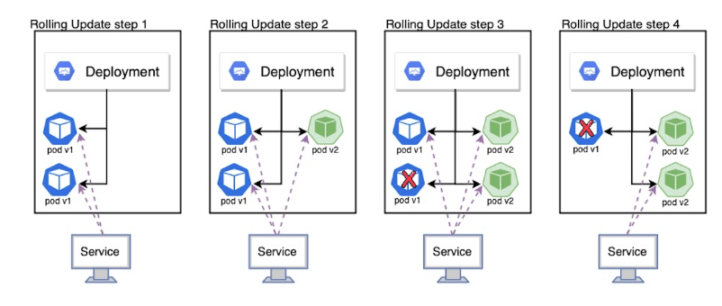
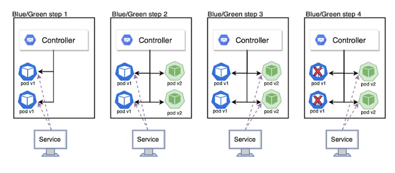

# Deployments

Deployment는 Pod 업데이트를 위해 사용되는 기본 컨트롤러이다.

## Deployment reason for use

> Replica Set을 그대로 사용하지 않고 상위 개념인 Deployment를 사용하는 이유

Deployment는 컨테이너 애플리케이션을 배포하고 관리하는 역할을 담당한다. 애플리케이션을 업데이트할 때 Replica Set의 변경 사항을 저장하는 리비전을 남겨 롤백을 가능하게 해주고, 무중단 서비스를 위해 Pod의 롤링 업데이트의 전략을 지정할 수도 있다.


## Deployment Update
Deployment Update 방식

1. Rolling Update
2. Recreate
3. Blue/Green
4. Canary

### 1. Rolling Update



Rolling Update는 별다른 설정을 하지 않을 시 기본적으로 적용되는 방식이다.
V1을 V2로 업데이트 할 때, V2를 하나 생성한 뒤 V1을 삭제하는 방식으로 Pod를 하나씩 점진적으로 교체해나가는 방법이다.
이 방법은 무중단 배포가 가능하다는 장점이 있지만, V1과 V2의 Pod가 공존하는 순간이 있다는 단점이 있다.

### 2. Recreate


Recreate는 재생성이다.
기존의 Pod를 모두 삭제한 뒤, 새로운 버전의 Pod를 선언한 개수만큼 생성해주는 방식이다.
단점으로는 순간적으로 Pod가 존재하지 않는 순간이 있다는 단점이 있다.

### 3. Blue/Green



Blue/Green 배포는 기존 버전의 Pod를 유지한채로 새로운 버전의 Pod를 선언한 개수만큼 생성하고 Service가 트래픽을 전달하는 대상을 교체한 뒤 기존의 Pod를 삭제하는 방식이다.
이 방법은 무중단 배포가 가능하고, 기존에 Rolling Update가 가지고 있던 V1, V2가 공존하는 순간이 있는 문제를 해결할 수 있지만, 배포시 자원을 2배로 사용한다는 단점이 있다.

### 4. Canary


Canary는 테스트라는 특징을 가지고 있다.
구버전과 신버전 Pod를 모두 구성한 뒤, 트래픽의 양을 조절하여 테스트를 진행한 다음 교체하는 방식이다.

## Rollout

``` yaml
apiVersion: apps/v1
kind: Deployment
metadata:
  name: myweb-deploy
spec:
  replicas: 3
  selector:
    matchLabels:
      app: web
  template:
    metadata:
      labels:
        app: web
    spec:
      containers:
        - name: myweb
          image: ghcr.io/c1t1d0s7/go-myweb:v1
          ports:
            - containerPort: 8080
```

``` yaml
apiVersion: v1
kind: Service
metadata:
  name: myweb-svc-lb
spec:
  type: LoadBalancer
  selector:
    app: web
  ports:
    - port: 80
      targetPort: 8080
```

``` bash
 vagrant@k8s-node1 > ~/deployment > kubectl rollout status deploy myweb-deploy
deployment "myweb-deploy" successfully rolled out
```

``` bash
 vagrant@k8s-node1 > ~/deployment > kubectl rollout history deploy myweb-deploy
deployment.apps/myweb-deploy 
REVISION  CHANGE-CAUSE
1         <none>
```

상기의 상세 정보를 보려면 `--revision` 옵션으로 번호를 지정한다.


``` bash
 vagrant@k8s-node1 > ~/deployment > kubectl set image deployments myweb-deploy myweb=ghcr.io/c1t1d0s7/go-myweb:v2.0 --record
Flag --record has been deprecated, --record will be removed in the future
deployment.apps/myweb-deploy image updated

 vagrant@k8s-node1 > ~/deployment > kubectl rollout status deploy myweb-deploy
Waiting for deployment "myweb-deploy" rollout to finish: 1 old replicas are pending termination...
Waiting for deployment "myweb-deploy" rollout to finish: 1 old replicas are pending termination...
deployment "myweb-deploy" successfully rolled out

 vagrant@k8s-node1 > ~/deployment > kubectl rollout history deploy myweb-deploy
deployment.apps/myweb-deploy 
REVISION  CHANGE-CAUSE
1         <none>
2         kubectl set image deployments myweb-deploy myweb=ghcr.io/c1t1d0s7/go-myweb:v2.0 --record=true
```

상기와 같이 변경의 사유가 출력되는데 이는 `set` 명령 실행 시 `--record` 옵션을 통해 명령을 히스토리에 저장한다.

**undo**

``` bash
 vagrant@k8s-node1 > ~/deployment > kubectl rollout undo deploy myweb-deploy   
deployment.apps/myweb-deploy rolled back

 vagrant@k8s-node1 > ~/deployment > kubectl rollout history deploy myweb-deploy
deployment.apps/myweb-deploy 
REVISION  CHANGE-CAUSE
2         kubectl set image deployments myweb-deploy myweb=ghcr.io/c1t1d0s7/go-myweb:v2.0 --record=true
3         <none>

```

2.0에서 1.0으로 undo, 되돌리는 것이지만 상기와 같이 3.0으로 표시된다. 즉, 다시 되돌아간 상태를 1.0이 아닌 3.0으로 본다.

``` bash
 vagrant@k8s-node1 > ~/deployment > kubectl rollout undo deploy myweb-deploy --to-revision=2
deployment.apps/myweb-deploy rolled back
```

상기와 같이 옵션으로 번호를 지정하여 해당 버전으로 undo한다. 

> 기본값은 바로 직전 버전


``` yaml
apiVersion: apps/v1
kind: Deployment
metadata:
  name: myweb-deploy
  annotations:
    kubernetes.io/change-cause: "Change Go Myweb version from 3 to 4"
    ...
```

``` bash
kubectl apply -f myweb-deploy.yaml
```

`set` 명령을 사용하면 이미지가 어떻게 변경됐는지 알 수 있지만, `apply` 명령은 어떻게 변경되었는지 알기 힘들다. 따라서 파일을 수정할 떄는 상기와 같이 `annotations`을 지정한다.


### Max Surge & Max Unavailable

- `maxSurge` : Rolling Update 도중 전체 파드의 개수가 Deploy의 replicas 값보다 얼마나 더 많이 존재할 수 있는지 설정한다.
- `maxUnavailable` : Rolling Update 도중 사용 불가능한 상태가 되는 파드의 최대 개수를 설정한다.

``` yaml
apiVersion: apps/v1
kind: Deployment
metadata:
  name: myweb-deploy
  annotations:
    kubernetes.io/change-cause: "Change Go Myweb version from 3 to 4"
spec:
  strategy:
    type: RollingUpdate
    rollingUpdate:
      maxSurge: 1
      maxUnavailable: 1
  replicas: 3
  selector:
    matchLabels:
      app: web
  template:
    metadata:
      labels:
        app: web
    spec:
      containers:
        - name: myweb
          image: ghcr.io/c1t1d0s7/go-myweb:v4.0
          ports:
            - containerPort: 8080
```

- Deployment의 replicas에 설정된 파드 개수 : 3개
- `maxUnavailable` : 1 (전체 파드 개수가 3개 이하로 떨어지지 않음)
- `maxSurge` : 2 (전체 파드 개수는 3 + 2 = 5개를 넘을 수 없음)