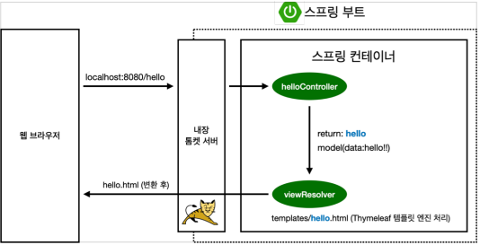

# 스프링 입문

## 1. 프로젝트 환경설정

### 1.1 프로젝트 생성

> start.spring.io
> Spring Web, Thymeleaf

### 1.2 라이브러리

#### Gradle은 의존관계가 있는 라이브러리를 함께 다운로드 한다.

스프링 부트 라이브러리
- spring-boot-starter-web
  - spring-boot-starter-tomcat : 톰캣(웹서버)
  - spring-webmvc : 스프링 웹 MVC
- spring-boot-starter-thymeleaf : 타임리프 템플릿 엔진(View)
- spring-boot-starter(공통) : 스프링 부트 + 스프링 코어 + 로깅
  - spring-boot
    - spring-core
  - spring-boot-starter-logging
    - logback, slf4j

테스트 라이브러리
- spring-boot-starter-test
  - junit : 테스트 프레임워크
  - mockito : 목 라이브러리
  - assertj : 테스트 코드를 좀 더 편하게 작성하게 도와주는 라이브러리
  - spring-test : 스프링 통합 테스트 지원

### 1.3 View 환경설정

#### Welcome Page 생성

`resources/static/index.html`
``` html
<!DOCTYPE HTML>
<html>
  <head>
    <title>Hello</title>
    <meta http-equiv="Content-Type" content="text/html; charset=UTF-8" />
  </head>
  <body>
    Hello
    <a href="/hello">hello</a>
  </body>
</html>
```

스프링 부트가 제공하는 Welcome Page 기능
- static/index.html 을 올려두면 Welcome page 기능을 제공한다.
- https://docs.spring.io/spring-boot/docs/2.3.1.RELEASE/reference/html/spring-boot-features.html#boot-features-spring-mvc-welcome-page

**thymeleaf 템플릿 엔진**
- thymeleaf 공식 사이트: https://www.thymeleaf.org/
- 스프링 공식 튜토리얼: https://spring.io/guides/gs/serving-web-content/
- 스프링부트 메뉴얼: https://docs.spring.io/spring-boot/docs/2.3.1.RELEASE/reference/html/spring-boot-features.html#boot-features-spring-mvc-template-engines


``` java
@Controller
public class HelloController {

  @GetMapping("hello")
  public String hello(Model model) {
    model.addAttribute("data", "hello!!");
    return "hello";
  }
}
```

`resources/templates/hello.html`
``` html
<!DOCTYPE HTML>
<html xmlns:th="http://www.thymeleaf.org">
<head>
  <title>Hello</title>
  <meta http-equiv="Content-Type" content="text/html; charset=UTF-8" />
</head>
<body>
<p th:text="'안녕하세요. ' + ${data}" >안녕하세요. 손님</p>
</body>
</html>
```

**thymeleaf 템플릿엔진 동작 확인**
실행: http://localhost:8080/hello

동작 환경


- 컨트롤러에서 리턴 값으로 문자를 반환하면 뷰 리졸버( viewResolver )가 화면을 찾아서 처리한다.
  - 스프링 부트 템플릿엔진 기본 viewName 매핑
  - `resources:templates/` +{ViewName}+ `.html`

### 1.4 빌드 및 실행

bash
1. ./gradlew build
2. cd build/libs
3. java -jar hello-spring-0.0.1-SNAPSHOT.jar

## 2. 스프링 웹 개발 기초

### 2.1 정적 컨텐츠

- 스프링 부트 정적 컨텐츠 기능
> https://docs.spring.io/spring-boot/docs/2.3.1.RELEASE/reference/html/spring-boot-features.html#boot-features-spring-mvc-static-content


`resources/static/hello-static.html`
``` html
<!DOCTYPE html>
<html lang="en">
<head>
  <title>static content</title>
  <meta http-equiv="Content-Type" content="text/html; charset=UTF-8" />
</head>
<body>
정적 컨텐츠 입니다.
</body>
</html>
```

정적 컨텐츠 이미지
[01](./img/01.png)


### 2.2 MVC와 템플릿 엔진

- MVC : Model, View, Controller

`Controller`
``` java
@Controller
public class HelloController {

  @GetMapping("hello-mvc")
  public String helloMvc(@RequestParam("name") String name, Model model) {
    model.addAttribute("name", name);
    return "hello-template";
  }
}
```

`View`
`resources/templates/hello-template.html`
``` html
<html xmlns:th="http://www.thymeleaf.org">
<body>
<p th:text="'hello ' + ${name}">hello! empty</p>
</body>
</html>
```

MVC, 템플릿 엔진 이미지
[02](./img/02.png)

### 2.3 API

`ResponseBody 문자 반환`
``` java
@Controller
public class HelloController {

  @GetMapping("hello-string")
  @ResponseBody
  public String helloString(@RequestParam(name = "name", required = false) String name) {
    return "hello " + name;
  }
}
```

- `@ResponseBody` 를 사용하면 뷰 리졸버(`viewResolver`)를 사용하지 않음
- 대신에 HTTP의 BODY에 문자 내용을 직접 반환(HTML BODY TAG를 말하는 것이 아님)

`@ResponseBody 객체 반환`
``` java
@Controller
public class HelloController {
  
  @GetMapping("hello-api")
  @ResponseBody
  public Hello helloApi(@RequestParam(name = "name", required = false) String name) {
      Hello hello = new Hello();
      hello.setName(name);
      return hello;
  }

  static class Hello {
    private String name;

    public String getName() {
      return name;
    }
    public void setName(String name) {
      this.name = name;
    }
  }
}
```
`@ResponseBody`를 사용하고, 객체를 반환하면 객체가 JSON으로 변환됨

@ResponseBody 사용 원리
[03](./img/03.png)

- `@ResponseBody` 를 사용
  - HTTP의 BODY에 문자 내용을 직접 반환
  - `viewResolver` 대신에 `HttpMessageConverter` 가 동작
  - 기본 문자처리: `StringHttpMessageConverter`
  - 기본 객체처리: `MappingJackson2HttpMessageConverter`
  - byte 처리 등등 기타 여러 HttpMessageConverter가 기본으로 등록되어 있음